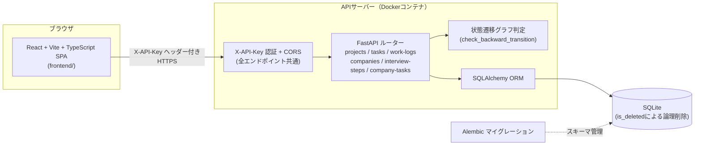

# TaskSupport（案件・選考トラッカー）

フリーランス案件（受注・稼働管理）と就職活動（企業・選考ステップ管理）を1つのツールで扱う、個人利用のWebアプリケーション。タスク管理ツールは世の中に多くあるが、自分の使い方に合わせてカスタマイズした、自分にとって使いやすいものを作りたいと考えて開発した。

バックエンド（FastAPI）・フロントエンド（React）・DBマイグレーション・CIパイプライン（lint → test → migration check → Dockerビルド）まで一人で設計・実装している。設計判断とその理由は原則すべて [`spec.md`](./spec.md) の「決定事項」セクションに残しており、本READMEはそこから要点を抜粋・整理したもの。

## デモ

**https://frontend-silk-kappa-cub22v0dtl.vercel.app** から実際に操作できる。

デモ用API Key: `demo-fb6713027aa00b2a`（画面上部の入力欄に貼り付けてください）

> [!NOTE]
> - **初回アクセス時、数秒〜数十秒待たされることがある**: 従量課金コストを抑えるため、一定時間アクセスが無いとサーバーがスリープする設定にしている。スリープ中にアクセスがあると自動的に起き上がるが、その間は応答が遅くなる（起動さえ終われば通常通り使える）
> - **デモデータは1日1回、自動的に初期状態へリセットされる**: 誰でも自由に作成・編集・削除を試せるようにするための仕様。他の訪問者が入力した内容が残っていたり、自分が加えた変更が翌日消えていたりすることがある

## できること

- **案件管理**: 案件（Project）→ タスク（Task）→ 稼働ログ（WorkLog）の3階層で、応募〜契約〜納品までの状態と実稼働時間を管理し、`reward ÷ 合計稼働時間` で実質時給を算出する
- **選考管理**: 企業（Company）→ 選考ステップ（InterviewStep）で、書類選考〜最終面接までの日程・準備状況・結果を管理する。企業側にも簡易タスク（CompanyTask）を持てる
- **横断ビュー**: 「直近の選考予定」「現在進行中の稼働ログ」をアプリ入口（ランディング）で一覧表示し、そこから各詳細へ遷移できる
- **状態遷移の見守り**: ステータス変更は一切ブロックしない。ただし「完了 → 処理中」のような明確な逆行を検知した場合のみ、レスポンスに `warning` を含めて200を返す（入力ミスの訂正を妨げないため）

## アーキテクチャ



- **案件系（Project/Task/WorkLog）と選考系（Company/InterviewStep）は完全に独立したドメイン**として設計している。テーブル間のrelationもAPIもフロントエンドの画面も交差させない。両者を1つのAPIにまとめているのは「1人の利用者が両方を同時に管理したい」という運用上の都合であり、ドメインとしての結合ではない
- 削除は全テーブル共通で `is_deleted` による論理削除。ヒューマンエラーによる誤削除からの復旧を優先し、物理削除は行わない
- 親の詳細取得（`GET /projects/{id}` 等）は子テーブルの情報を含めない。子一覧が必要な場合は専用エンドポイントを叩く、というシンプルな責務分割にしている

## 設計判断と理由（抜粋）

実装の細部よりも「なぜその選択をしたか」を重視している。全項目は [`spec.md` の決定事項セクション](./spec.md#決定事項) 参照。

| 判断 | 採用した方式 | 理由 |
|---|---|---|
| ステータス逆行の検知 | 単一の順序リストではなく、状態ごとに遷移先を定義する**状態遷移グラフ**＋到達可能性判定（BFS） | 「見送り」「不通過」のような分岐的な結果ステータスを1本の順序に無理やり押し込むと、枝分かれ先同士の関係が表現できなくなるため |
| 認証 | 環境変数の固定キーを `X-API-Key` で照合。ロジックから独立した1箇所（`Depends`）に集約 | 1人専用ツールなので複数キー発行やローテーションは過剰。ただし将来ログイン認証へ差し替える可能性を見込み、差し替えコストを最小化する構造にしている |
| CORS許可オリジン | 環境変数へのカンマ区切り列挙。未設定時は**全オリジン拒否**（fail-closed） | 設定漏れが「全オリジン許可」という危険側に倒れないようにするため。ワイルドカードはデフォルトにしない |
| API Keyのブラウザ保持 | 画面から入力し `sessionStorage` に保持（ビルド埋め込み・`localStorage` は不採用） | ビルド埋め込みは配布JSから誰でも読める。`localStorage`はブラウザを閉じても残る分、端末共有時やXSS発生時の漏洩範囲が広がる。メモリ保持のみが最安全だが毎回再入力が必要で日常利用に不向き、という3案のトレードオフを比較して選定 |
| 本番Dockerイメージの実行ユーザー | 非root専用ユーザー。DBファイルの書き込み先（`/app/data`）だけをそのユーザー所有にし、アプリコード・`.venv`はroot所有で書き込み不可のまま | 任意ファイル書き込み系の脆弱性が仮にあっても、アプリコード自体の改ざん（偽ライブラリ設置等）による被害拡大を防ぐため |
| 既存開発用DBのマイグレーション移行 | DBを作り直さず、現状スキーマを「初期マイグレーション適用済み」として履歴だけ追記 | 開発中に登録した実データ（案件・選考データ）を破棄したくなかったため |
| ステータス変更のブロック方針 | 変更自体は常に許可し、逆行時のみ`warning`を返す（拒否しない） | 入力ミスの訂正フローを妨げないことを、厳密なバリデーションより優先 |

## 技術スタック

**バックエンド**
- FastAPI + Pydantic
- SQLAlchemy 2.0 + Alembic（マイグレーション管理）
- SQLite
- pytest（240ケース、状態遷移ロジックの単体テスト〜TestClientによるエンドポイントテスト）
- ruff（lint）

**フロントエンド**（`frontend/`、モノレポ構成）
- React 19 + TypeScript + Vite
- MUI（UIコンポーネント）
- react-router-dom（軽量ルーティング。詳細ダイアログへの直接リンクに対応）
- Vitest + Testing Library
- oxlint（lint）

**インフラ / CI**
- GitHub Actions: `lint(ruff) → test(pytest) → migrate(alembic upgrade headの検証) → build(Dockerマルチステージ)` の順に実行し、いずれかが失敗すると後続に進ませない
- Docker マルチステージビルド（非rootユーザー実行、依存関係インストールとアプリコードのレイヤーキャッシュ分離）

## APIエンドポイント概要

全エンドポイントは `X-API-Key` ヘッダーによる認証が必須（`/docs` 等のドキュメントUIは本人専用ツールという性質上、認証バイパス経路を塞ぐため無効化している）。全リストは [`spec.md` のエンドポイント一覧](./spec.md#エンドポイント一覧) 参照。

| ドメイン | 主なエンドポイント |
|---|---|
| 案件（Project） | `POST/GET/PATCH/DELETE /projects`, `GET /projects/{id}/hourly-rate` |
| タスク（Task） | `POST /projects/{id}/tasks`, `GET/PATCH/DELETE /tasks/{id}` |
| 稼働ログ（WorkLog） | `POST /tasks/{id}/work-logs/start`, `PATCH /work-logs/{id}/stop`, `GET /work-logs/running` |
| 企業・選考ステップ | `POST/GET/DELETE /companies`, `POST/GET/PATCH/DELETE /interview-steps`, `GET /interview-steps/upcoming` |
| 企業タスク（CompanyTask） | `POST/GET/PATCH/DELETE /company-tasks` |

## ディレクトリ構成

```
.
├── backend/
│   ├── app/
│   │   ├── main.py            # アプリ組み立て（認証・CORS・ルーター登録）
│   │   ├── auth.py            # X-API-Key認証
│   │   ├── cors.py            # CORS設定
│   │   ├── models.py          # SQLAlchemyモデル
│   │   ├── schemas.py         # Pydanticスキーマ
│   │   ├── status_transitions.py  # 状態遷移グラフ + 逆行判定の純粋関数
│   │   └── routers/           # ドメインごとのエンドポイント
│   ├── migrations/            # Alembicマイグレーション
│   └── tests/
├── frontend/
│   └── src/
│       ├── api/                # APIクライアント・型定義
│       └── components/         # 画面（案件ページ / 選考ページ / 横断一覧）
├── spec.md                    # 仕様書・設計判断ログ・実装タスク一覧
└── Dockerfile
```

## セットアップ・実行方法

### バックエンド

```bash
uv sync --locked
export API_KEY=dev-api-key
export CORS_ALLOW_ORIGINS=http://localhost:5173
uv run alembic -c backend/alembic.ini upgrade head
uv run uvicorn app.main:app --reload --app-dir backend
```

### フロントエンド

```bash
cd frontend
npm install
cp .env.example .env.local   # VITE_API_BASE_URL を編集
npm run dev
```

起動後、画面上の入力欄でAPI Keyを入力すると接続できる（`sessionStorage`に保持されるため、リロードしても再入力不要・タブを閉じると破棄される）。

## テスト / Lint

```bash
# バックエンド
uv run pytest
uv run ruff check .

# フロントエンド
cd frontend
npm run test
npm run typecheck
npm run lint
```

## ライセンス

個人開発ツールのため未設定（ポートフォリオ閲覧目的での参照は自由）。
